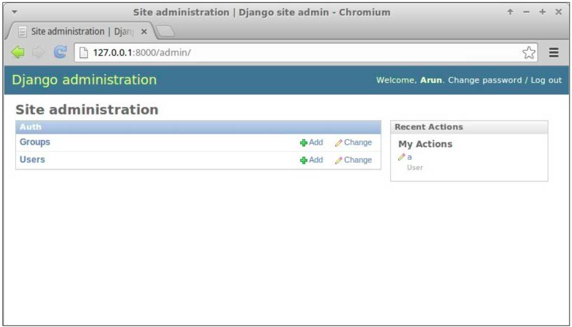
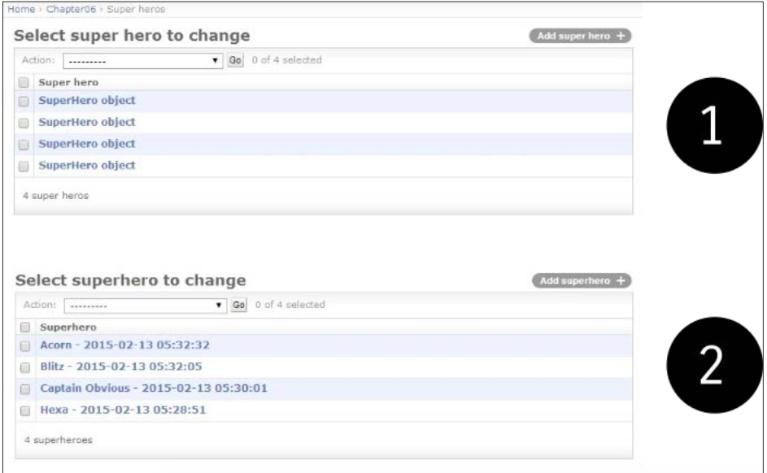

第六章-Admin接口
**************
这一章，我们会讨论以下话题：  

- 定制admin
- 增强admin的模型
- Admin的最佳实践
- 特性标识

Django被谈论到最多的是, 与其他的竞争对手相比它将admin接口独立了出来。。admin接口是一个自动地生成添加和修改一个站点内容的用户接口。不仅如此，admin也是Django的杀手级应用，它使项目中对模型生成admin接口的乏味的任务可以自动化。  

admin能够让你的团队在同一时间内添加内容，不间断开发。只要模型已经应用了迁移，你仅需添加一行或者两行代码就可以生成模型的的admin接口。  

## 使用admin接口
在Django1.7中，admin接口默认是启用的。在创建项目之后，你浏览`http://127.0.0.1:800/admin`时能够看到一个登录页面。  

如果输入超级用户凭证（或者任意站点注册用户的凭证），那么你会登录到admin中，一如下面截图所示：  



不过，模型在admin管理界面是不可见的，除非你定义一个与之对应的`ModelAdmin`类。这个操作通常定义在应用的admin.py文件，一如下面所示：
  
```python
    from django.contrib import admin
    from . import models
    admin.site.register(models.SuperHero)
```
  
此处，`ModelAdmin`的到注册器的第二个参数被省略。因此，我们会获得一个默认的Post模型的admin接口。让我们看看如何创建并自定义``ModelAdmin`类。

>### 注释
**引路人**
“还有咖啡吗☕️？“一个声音来自备餐室角落的声音问道。苏差点儿把咖啡洒了出来。她前面站着一位身着紧身红蓝相间衣服👔，面带微笑，将手叉在腰间的高个子男人。

>"Oh, my god," said Sue as she wiped the coffee stain with a napkin. "Sorry, I think I scared you," said Captain Obvious "What is the emergency?"
"Isn't it obvious that she doesn't know?" said a calm feminine voice from above. Sue looked up to find a shadowy figure slowly descend from the open hall. Her face was partially obscured by her dark matted hair that had a few grey streaks. "Hi Hexa!" said the Captain "But then, what was the message on SuperBook about?"  

>“哎呦喂，”苏说道，同时另一边她小毛巾擦掉了泼出去的咖啡。“不好意啊，吓到你了，”装傻队长问道。“什么事这么急啊？”

>Soon, they were all at Steve's office staring at his screen. "See, I told you there is no beacon on the front page," said Evan. "We are still developing that feature." "Wait," said Steve. "Let me login through a non-staff account."
In a few seconds, the page refreshed and an animated red beacon prominently appeared at the top. "That's the beacon I was talking about!" exclaimed Captain Obvious. "Hang on a minute," said Steve. He pulled up the source files for the new features deployed earlier that day. A glance at the beacon feature branch code made it clear what went wrong:  

>几秒钟之后，页面重新刷新，然后一个重要的红色提醒出现在顶部。“这就是我提到的信标！”装傻队长说道。“稍等一下啊，”斯蒂夫说到。他从前些天部署的新功能拉取了原文件。稍微看下信标功能的分支代码能够搞清楚到底哪里出问题了：  

>
```python
    if switch_is_active(request, 'beacon') and not
      request.user.is_staff():
           # Display the beacon
```


>“各位不好意思，”斯蒂夫说道。“这里出现了一个逻辑错误。我们一时疏忽就将该功能的启用开放给了所有人，而不是仅有站点注册用户来开启。现在我把这个功能给关闭了。对于因此而引起的混乱我表示歉意。”

>"So, there was no emergency?" said Captain with a disappointed look. Hexa put an arm on his shoulder and said "I am afraid not, Captain." Suddenly, there was a loud crash and everyone ran to the hallway. A man had apparently landed in the office through one of the floor-to-ceiling glass walls. Shaking off shards of broken glass, he stood up. "Sorry, I came as fast as I could," he said, "Am I late to the party?" Hexa laughed. "No, Blitz. Been waiting for you to join," she said.  

>“这么说，根本没什么要紧事喽？”队长带着一脸失望😞的说道。Hexa一面把手搭在他肩膀上一边说道：“我也不希望发生什么事情，队长。”突然之间，室内闪现出一团云，屋里的人都赶紧跑开了。  

## 增强用于admin的模型
admin应用足够聪明，因此它可以自动地从模型发现非常多东西。可是，有时候推定信息需要改进。这通常涉及到模型自身添加一个属性或者一个方法（而不是在`ModelAdmin`类中添加）。  

首先，为了更好的说明问题，让我们来看一个包括admin接口而增强模型的例子：  

```python
# models.py
class SuperHero(models.Model):
    name = models.CharField(max_length=100)
    added_on = models.DateTimeField(auto_now_add=True)

    def __str__(self):
        return "{0} - {1:%Y-%m-%d %H:%M:%S}".format(self.name,
                                                   self.added_on)
    def get_absolute_url(self):
        return reverse('superhero.views.details', args=[self.id])

    class Meta:
        ordering = ["-added_on"]
        verbose_name = "superhero"
        verbose_name_plural = "superheroes"
```
  

我们看看admin是如何利用这些非字段属性的：  


- `__str__()`: 没有它的话，superhero条目的列表看上去会极其无趣的。每一个条目都请清楚地显示为`<SuperHero: SuperHero object>`。试着去包含对象自己的`str`表现形式的唯一信息（在Python2中的代码，是`unicode`表现形式），比如对象自己的名称或者版本。任何能够有助于admin不含糊地理解的东西都是大有裨益的。

- get_absolute_url(): 如果你喜欢在网站中的admin视图和对象详细视图之间切换，该属性会很方便的。如果该方法被定义，那么在admin页面中对象的编辑页面的右上会出现一个叫做`”View on site“`的按钮。

- ordering: 如果没有这个元选项，你的条目会在数据数据库返回后以任意顺序出现。你也可以想象一下，如果你有大量的项目对于管理来说可不是好玩的。刷新项通常优先被看到，所以按照反向的时序来排列日期是很常见的。  

- verbose_name: 如果你忽略该属性，模型的名称会从`CamelCase`转换到`camelcase`。这个例子中，“super hero`看上去不那么优美，因此最好是明确你要如何将用户可读的名称显示在admin接口。

- verbose_name_plural: 再者，忽略该选项能够给你带来比较有趣的结果。因为Django简单地将一个‘s’预加到单词，复数形式的superhero显示为`”superheros“`(仍旧出现在admin前面的页面)。因此，这里最好是正确地定义它。

这里建议你定义前面的`Meta`属性和方法，而不仅仅是只用于admin接口，而且也是为了在shell中和日志文件中，等等中更好的表现内容。  

当然，你也可以像下面这样，通过创建一个`ModelAdmin`类来进一步改进在admin里的显示：  

```python
# admin.py
class SuperHeroAdmin(admin.ModelAdmin):
   list_display = ('name', 'added_on')
   search_fields = ["name"]
   ordering = ["name"]


admin.site.register(models.SuperHero, SuperHeroAdmin)
```
  
让我们来仔细地看看这些选项：  

- list-display: 该选项在一个表格形式的表单中该显示模型实例。它显示每个独立可排序列的字段。如果你希望看到模型的多个属性，该选项是非常理想的。

- search_fields: 该选项在列表上面显示一个搜索框。任何的输入的搜索项都可以搜索到对应的引用字段。因此，仅有CharField或者TextField这样的文本字段被引用。  

- ordering: 该选项优先于模型的默认顺序。在admin后台管理中选择一个不同的顺序时，会很有用的。 




`加强过的模型admin页面`

前面的截图插入内容为：  

- 插入内容1: 不使用str或者Meta属性  

- 插入内容2: 使用增强的模型meta属性  

- 插入内容3: 使用定制的ModelAdmin 

这里我们仅仅提到了一个常用的amdin选项子集。某些类型的网站会重度地使用admin接口。在这样地情况下，这里强烈建议你彻彻底底搞明白Django文档的admin部分。  

## 不应该让所有人都成为admin
Since admin interfaces are so easy to create, people tend to misuse them. Some give early users admin access by merely turning on their 'staff' flag. Soon such users begin making feature requests, mistaking the admin interface to be the actual application interface.  

因为admin接口太容易就创建了，用户可能会滥用这个功能。

Unfortunately, this is not what the admin interface is for. As the flag suggests, it is an internal tool for the staff to enter content. It is production-ready but not really intended for the end users of your website.
It is best to use admin for simple data entry. For example, in a project I had reviewed, every teacher was made an admin for a Django application managing university courses. This was a poor decision since the admin interface confused the teachers.  

不幸的是这不是admin接口的原本用意。就像旗标所建议的那样，它只是一个用于站点成员输入内容的内部工具。它被用于生产环境，而且并没有打算面向网站的终端用户。  

The workflow for scheduling a class involves checking the schedules of other teachers and students. Using the admin interface gives them a direct view of the database. There is very little control over how the data gets modified by the admin.  

类的计划工作流涉及到了检查其他教师和学生的计划任务。使用admin接口给他们一个直接的数据库视图。admin对数据的修改需要非常微小的控制。  

So, keep the set of people with admin access as small as possible. Make changes via admin sparingly, unless it is simple data entry such as adding an article's content.  

因此，你要保持能够访问admin人群数量尽可能少。通过admin操作地变更要谨慎，除非是添加一篇文章内容这样地简单数据条目操作。  

>###提示
**最佳实践**
不要对终端用户开放admin访问。  

Ensure that all your admins understand the data inconsistencies that can arise from making changes through the admin. If possible, record manually or use apps, such as django-audit-loglog that can keep a log of admin changes made for future reference.  

请确保网站的所有管理员都理解了可能带来的数据不一致性对正在操作变更的其他管理员的影响。如果有可能的话，手工纪录活着使用应用，比如django-audit-loglog保存admin的变更日志以应对未来的引用需要。  

In the case of the university example, we created a separate interface for teachers, such as a course builder. These tools will be visible and accessible only if the user has a teacher profile.  

在这个大学校园的例子中，我们为教师创建了独立的接口，比如课程构造器。这些工具仅在用户拥有教师账户时才可以被访问。  

Essentially, rectifying most misuses of the admin interface involves creating more powerful tools for certain sets of users. However, don't take the easy (and wrong) path of granting them admin access.  

基本上，要修正大多数的admin接口滥用问题，涉及到了为了某一组用户创建更加强大的工具。不过，还要对admin的设置的很简单（错误）授权路径。  

## admin接口的定制
开箱即用单admin接口对于准备使用它的人来说非常有用。不幸的是，很多人都假设改变Django的admin肯定非常困难，然后就撒手不管了。实际上，admin是属于极其易于定制的，它的外观可以用最少的努力就得以改变。  

## 改变标题
Many users of the admin interface might be stumped by the heading—Django administration. It might be more helpful to change this to something customized such as MySite admin or something cool such as SuperBook Secret Area.  

很多admin用户或许被标题——Django administration给难住了。将这个标题改为某些自定义的内容，比如MySite admin或者其他的炫酷的标题，比如SuperBook Secret Area。  

更改变标题很容易。在站点的urls.py中添加下面这行内容就好了：  

```python
    admin.site.site_header = "SuperBook Secret Area"
```

## 改变基本样式
几乎所有的admin页面都扩展自叫做admin/base_site.html都公共基本模板。这意味着只需用到少量都HTML和CSS的知识，因此你可以定制所有的排序以改变admin接口的外观和视觉。

先简单地在任意地模板目录中创建一个名称为admin的目录。然后，从Django源目录复制文件base_site.html，并按照自己的需要做相应的变更。如果你不知道模板的位置，那么在Django shell中运行下面的命令就是了：  

```python
>>> from os.path import join
>>> from django.contrib import admin
>>> print(join(admin.__path__[0], "templates", "admin"))
```

例如，定制admin的基础模板，你可以改变admin接口的整个字体为谷歌字体“Special Elite”，谷歌的这个字体看上去非常的厚重。你需要使用以下内容在项目中的模板目录中添加一个文件admin/base_site.html；  

```python


   <link href='http://fonts.googleapis.com/css?family=Special+Elite'
rel='stylesheet' type='text/css'>
   <style type="text/css">
    body, td, th, input {
      font-family: 'Special Elite', cursive;
} </style>

```

该代码通过添加一个附加的样式表来重写与字体相关的样式，而且附加的样式会应用于每个admin的页面。  

## 添加富文本编辑器
有时候，你需要在admin接口中使用JavaScript代码。常见的一个需求就是对TextField使用CKEditor这样的HTML编辑器。  

在Django中有多种实现这个编辑器的方法，例如，对ModleAdmin类使用一个Media内部类。不过，我发现扩展admin的change_form模板是最方便的方法。  

例如，假如你拥有一个称作Posts的应用，那么你需要去在template/admin/posts/directory目录之内新建一个称作change_form.html的文件。如果你需要在这个应用内的任意模型中显示CKEditor，那么这个文件的内容是这个样子的：  

```python
/home/arun/env/sbenv/lib/python3.4/site-packages/django/contrib/admin/templates/admin  
```

该文件中的最后一行是所有admin模板中的位置所在。你可以重写或者扩展这些模板中的任何一个。可以参考下一小节的扩展模板的例子。  

```python


 {{ block.super }}
 <script src="//cdn.ckeditor.com/4.4.4/standard/ckeditor.js"></script>
<script> CKEDITOR.replace("id_message", {
    toolbar: [
    [ 'Bold', 'Italic', '-', 'NumberedList', 'BulletedList'],],
    width: 600,
  });
 </script>
 <style type="text/css">
  .cke { clear: both; }
 </style>

```

高亮的部分是用于我们希望将一个普通的文本输入框加强为富文本编辑器的表单元素的自动创建的ID。这些脚本和样式眼睛被添加到了footer块，这样表单元素可以在自身被改变之前，于DOM中创建。  

## 使用Bootstrap主题的admin

总的来说，admin接口已经设计非常好了。不过，由于它是在2006年设计的，而且是为了显示效果的通用性做出的设计。因此，它没有适应mobile设备，或者是拥有其他的已经成为今日事实标准的细节部分。  

毫不奇怪的是admin定制中最常见要求是确定是否可以继承Bootstrap。有多个包可以实现这个需求，比如django-admin-bootstrapped或者djangosuit。  


这些包提供了开箱即用的基于Bootstrap主题的模板，而不是你自己去重新编写所有的admin模板。因为基于Bootstrap，所以它们拥有响应式功能，而且包含了多种部件和组件。  

## 彻底检查
admin接口也已经在我们的尝试下完全的重写了。Grappelli是一个非常流行皮肤，它能够利用功能扩展Django admin，比如自动查询和折叠嵌套。使用django-admin-tools，你可以获得一个可定制的面板和工具栏。  

There have been attempts made to completely rewrite the admin, such as django-admin2 and nexus, which did not gain any significant adoption. There is even an official proposal called AdminNext to revamp the entire admin app. Considering the size, complexity, and popularity of the existing admin, any such effort is expected to take a significant amount of time.  

这里也有完全重写admin的尝试，比如django-admin2和nexus，它们不会着重使用的。

## 保护admin
The admin interface of your site gives access to almost every piece of data stored. So, don't leave the metaphorical gate lightly guarded. In fact, one of the only telltale signs that someone runs Django is that, when you navigate to http://example. com/admin/, you will be greeted by the blue login screen.  

网站的admin接口几乎访问了每一块存储的数据。因此，不要留下缺少保护的后门。实际上，


在生产环境中，我们建议你将这个地址改为不太显眼的地址。在项目的根urls.py中尽可能简单地变更该行：  

```python
url(r'^secretarea/', include(admin.site.urls)),
```

一个稍微更加成熟的做法是在默认位置使用假的admin站点或者蜜罐（参见第三方包`django-admin-honeypot`）。不过，最好的选择对admin站点范围内使用HTTPS，因为常规的HTTP会把所有的数据以明文格式发送到网络中去。  

检查web服务器的文档，看看如何为到admin的请求设置HTTPS。在Nginx上面，设置这个连接方式非常的简单，涉及到的有指定SSL认证位置。最后，将所有到admin页面的HTTP请求重定向到HTTPS，现在可以安生地睡个好觉了。  

The following pattern is not strictly limited to the admin interface but it is nonetheless included in this chapter, as it is often controlled in the admin.  

下面的模式没有严格地限制admin接口，但是这个模式尽管出现了这一章的内容之中，这些模式常常被控制在了admin中。  

## 模式－ 功能标识
遇到的问题：对用户发布的新功能，以及在生产环境中部署的对应代码都应当是互相独立的。  

解决方法：在部署之后，使用功能标识有选择性地启动或者禁用功能。  

### 问题细节
Rolling out frequent bug fixes and new features to production is common today. Many of these changes are unnoticed by users. However, new features that have significant impact in terms of usability or performance ought to be rolled out in a phased manner. In other words, deployment should be decoupled from a release.  

现如今，惯常的bug修复和新功能在生产环境中是很常见的。对于用户这些改变中很多的改变是不被通知的。不过，新的功能在可用性方面具有重大的影响，或者在阶段执行中可能会抛出性能问题。换句话来说，部署应该从发布中拆解出来。  

Simplistic release processes activate new features as soon as they are deployed. This can potentially have catastrophic results ranging from user issues (swamping your support resources) to performance issues (causing downtime).  

只要这些应用部署过之后，就简单地释放并处理新功能的激活。这可能导致灾难性的结果包括用户问题（清除你所提供支持的内容）到性能问题（引起宕机）。  

Hence, in large sites it is important to decouple deployment of new features in production and activate them. Even if they are activated, they are sometimes seen only by a select group of users. This select group can be staff or a sample set of customers for trial purposes.  

因此，在生产环境中对于大型站点来说最重要的是解构新功能的部署，并激活这些新功能。即使这些新功能被激活了，它们也只是仅仅对被选择了的用户可见。这个被挑选出来的组可以是站点注册成员，也可以是一组简单的出于试验目的而存在的用户。  

### 解决方法细节
Many sites control the activation of new features using Feature Flags. A feature flag is a switch in your code that determines whether a feature should be made available to certain customers.  

很多网站的新功能激活是透过功能标识实现的。功能标识是一个代码中的可以决定一个功能是否对某些用户开放的开关。  


Django有多个提供功能标识的包，比如 gargoyle 和 django-waffle。这些包在网站的数据库中存储功能标识。他们能够透过admin接口或者管理命令进行激活或者失效。因此，每一种环境（生产、测试、开发、等等）都可以拥有属于自己的一组激活功能。  

Feature flags were originally documented, as used in Flickr (See http://code. flickr.net/2009/12/02/flipping-out/). They managed a code repository without any branches, that is, everything was checked into the mainline. They
also deployed this code into production several times a day. If they found out
that a new feature broke anything in production or increased load on the database, then they simply disabled it by turning that feature flag off.  

功能旗帜是得到原生的文档支持，一如用在Flickr。它们不用任何分支管理代码仓库，即，一切内容都记录到主线中。它们在一天可以多次部署到生产环境中。如果在生产环境中发现新的功能破坏了任何其他东西，或者增加了数据库的负载，那么它们都通过关闭功能旗帜来简单的禁用。  

Feature flags can be used for various other situations (the following examples use django-waffle):  

功能标识可以用于多种情况（下面的例子使用的是django-waffle）：  

- Trials:
    A feature flag can also be conditionally active for certain users.
    These can be your own staff or certain early adopters than you may be targeting as follows:
- 试用：
  功能标识也可以根据条件针对部分用户激活。  
  如下，这些用户可以是站点的注册成员，或者某些你想指定监护人：  
  

```python
def my_view(request):
    if flag_is_active(request, 'flag_name'):
    # Behavior if flag is active. 
```

Sites can run several such trials in parallel, so different sets of users might actually have different user experiences. Metrics and feedback are collected from such controlled tests before wider deployment.  
  
站点可以平行的运行多个这类测试，这样不同组的用户实际上可以拥有不同的用户体验。在大范围部署之前，可以从这里可控制的测试中收集质量和反馈。  

- A/B testing: This is quite similar to trials except that users are selected randomly within a controlled experiment. This is quite common in web design to identify which changes can increase the conversion rates. This is how such a view can be written:  
- A/B测试：该测试很类似于体验测试，除了用户在被控制的试验中随机地选择用户。对于web设计来说识别出哪个变更能够增加转换速率是相当常见的。这也展示这样的一个视图是如何编写的：  

```python
def my_view(request):
    if sample_is_active(request, 'design_name'):
    # Behavior for test sample. 针对测试例子的具体行为
```

-  Performance testing: Sometimes, it is hard to measure the impact of a feature on server performance. In such cases, it is best to activate the flag only for a small percentage of users first. The percentage of activations can be gradually increased if the performance is within the expected limits.  
-  性能测试：有时候，很难去测量服务器上一个功能性能影响。这类例子中，最好是首先仅对一小部分激活旗帜。如果性能存在未预料地的限制，激活百分比可以逐渐地增加。  

- Limit externalities: We can also use feature flags as a site-wide feature switch that reflects the availability of its services. For example, downtime in external services such as Amazon S3 can result in users facing error messages while they perform actions, such as uploading photos.  
- 扩展性的限制：我们也可以使用功能旗帜

When the external service is down for extended periods, a feature flag can be deactivated that would disable the upload button and/or show a more helpful message about the downtime. This simple feature saves the user's time and provides a better user experience:  

当扩展服务因为扩展周期而关闭时，新的功能旗帜被取消激活将会禁用上传按钮同时／或者显示关于关闭时间更为有帮助的消息。这个简单的功能保存了用户的时间并提供了更好的用户体验：  

```python
def my_view(request):
    if switch_is_active('s3_down'):
    # Disable uploads and show it is downtime 禁用上传并在被禁用时显示
```

The main disadvantage of this approach is that the code gets littered with conditional checks. However, this can be controlled by periodic code cleanups that remove checks for fully accepted features and prune out permanently deactivated features.  

这个方法的主要缺点是按照某些条件检查代码会变得垃圾。不过，


## 总结
本章我们探究了Django的内建应用admin。我们发现了它不仅仅是非常好用的开箱即用，而且可以实现各种定制，以改进它的外观和功能。  

下一章，我们将会通过思考多种模式和常见用法来学习在Django中如何更有效的使用表单。  
